# Informe final de proyecto: Replicación independiente del pipeline de Lopes et al. (2023) sobre OpenNeuro `ds004504` y comparación STFT vs CWT-Morlet como etapa de descomposición tiempo-frecuencia

**Sebastián Palacio Betancur**

*Universidad Nacional de Colombia — Sede Medellín*
*Facultad de Minas*

Curso: Tópicos en Procesamiento Digital de Señales
Profesor: Freddy Bolaños

Julio de 2026

---

## Resumen ejecutivo

Este trabajo replica de forma independiente el pipeline de Lopes et al. (2023) —una CNN sobre el espectrograma de modulación del EEG con selección de regiones guiada por saliencia y un SVM final— sobre el dataset público OpenNeuro `ds004504` (Miltiadous et al., 2023) (65 sujetos: 36 AD + 29 HC), y lo extiende comparando **STFT** y **CWT-Morlet** como etapa de descomposición tiempo-frecuencia. Todas las cifras se reportan como media ± SD sobre 3 semillas de inicialización (LOSO-CV, 65 folds, anti-leakage estricto por fold en preproceso, saliency y selección de features).

La replicación funciona: el SVM con saliencia vainilla y STFT —la configuración fiel al paper— alcanza **Acc 0.764 ± 0.009** y **AUC 0.856 ± 0.022**, en el rango del 0.71 ± 0.02 de Lopes sobre datos públicos independientes. El hallazgo central, sin embargo, es metodológico. La comparación STFT vs CWT está contaminada por un **artefacto de procesamiento de señales en el eje de modulación**: STFT y CWT nativa no muestrean ese eje al mismo ritmo (Nyquist de modulación 1.56 Hz vs 100 Hz), de modo que sus imágenes 45×45 no codifican el mismo contenido. Al añadir una tercera condición de control —**CWT-fair**, la misma CWT con la envolvente de potencia decimada para igualar el eje de modulación de la STFT— las diferencias aparentes se reducen sustancialmente y ninguna comparación resulta significativa: a igualdad de eje, no se detecta diferencia entre STFT y CWT-Morlet.

**Hallazgos**:

1. La replicación del pipeline funciona sobre datos públicos (Acc 0.764, AUC 0.856; §4.1).
2. Las diferencias aparentes STFT vs CWT eran **en gran parte un artefacto del eje de modulación**, no de la transformada: con el eje igualado (CWT-fair) las tres arquitecturas convergen y ninguna comparación justa sobrevive la corrección por comparaciones múltiples (§4.2).
3. Es *ausencia de diferencia detectable*, **no equivalencia probada** —un TOST (δ = ±0.05) no la declara; un *late-fusion* STFT+CWT-fair sugiere complementariedad parcial no concluyente (§4.4).
4. El método de saliency altera el ranking aparente entre STFT y CWT nativa, pero esa sensibilidad también se atenúa al controlar el eje (§5.2).
5. Análisis exploratorio (post-hoc): STFT + vainilla concentra ~89% de la saliency en bandas α (61%) + θ (28%) y canales occipito-temporales, coherente con la literatura clínica EEG-AD (§4.3).

---

## 1. Introducción y trabajo relacionado

### 1.1 Motivación y espectro de modulación

La enfermedad de Alzheimer (EA) es la causa más común de demencia, con más de 55 millones de personas afectadas globalmente (OMS, 2023). El diagnóstico temprano es crítico para la intervención, pero las técnicas estándar de imagen (RM, PET) son costosas y poco accesibles; el EEG, no invasivo, portátil y económico, es una alternativa promisoria para tamizaje a escala poblacional. El *espectrograma de modulación* del EEG captura periodicidades de segundo orden —cómo varía en el tiempo la energía de cada componente espectral—. Formalmente, dada una representación tiempo-frecuencia X(t,f):

`M(f, f_m) = F_t{ |X(t,f)|^2 }`

donde f es la frecuencia portadora y f_m la de modulación. Trambaiolli (2011), Fraga (2013), Cassani (2020) y Lopes (2023) han mostrado que esta representación captura biomarcadores discriminativos de EA. En particular, Lopes et al. (2023) —el trabajo que aquí se replica— entrenan una CNN sobre el espectrograma de modulación y usan **mapas de saliencia** (gradiente vainilla) para descubrir regiones discriminativas ("patches"); sobre esas regiones calculan potencia + ratios como features para un SVM final, y reportan Acc ~0.71 en LOSO-test sobre N = 39 sujetos de un dataset privado.

### 1.2 El eje de modulación y dónde se abre el confound

En la formulación canónica del espectro de modulación de EEG (Fraga 2012; Cassani 2013; Cassani y Falk, 2020) el front-end tiempo-frecuencia **no es una STFT ni una CWT, sino un banco de filtros** que descompone la señal en las subbandas convencionales (δ, θ, α, β, γ), y la envolvente de amplitud se obtiene por **transformada de Hilbert** (que conserva la tasa de muestreo original). Sobre esa envolvente se calcula la FFT temporal, y el eje de modulación queda **fijado por diseño** mediante un segundo banco de filtros. Es decir: en toda la saga el eje de modulación lo determina un único front-end aplicado idénticamente a todos los sujetos; nunca es una variable libre, y por eso el confound **no puede aparecer**.

Lopes et al. (2023) generalizan la receta a `M(f, f_mod) = F_t{ |X(t,f)|^2 }` y afirman que el mapeo T-F "puede ser una STFT o una wavelet", pero **no comparan ambas, no especifican ventana/hop/overlap, y no mencionan el Nyquist ni el rango del eje de modulación**. Tratan STFT y wavelet como intercambiables sin advertir que cambian la tasa de muestreo de la envolvente y, con ella, el eje de modulación. El confound **se materializa precisamente al instanciar esa receta con front-ends distintos** —exactamente lo que ocurre al replicar el trabajo y extenderlo con CWT—. Diagnosticar ese confound, introducir un control para él y medir su efecto es la contribución metodológica de este TFM (se posiciona frente a la literatura en §5.4).

### 1.3 Objetivos y pregunta de investigación

Este trabajo persigue cuatro objetivos: (1) **validar de forma independiente** el pipeline de Lopes sobre el dataset público `ds004504`; (2) **comparar STFT vs CWT-Morlet** como etapa de descomposición tiempo-frecuencia; (3) **cuantificar la varianza por seed** con multi-seed LOSO-CV; y (4) **analizar la interpretabilidad** de las regiones descubiertas en términos de bandas canónicas y canales. Todo ello responde a una pregunta:

> *¿Produce la sustitución de la STFT por la CWT con wavelet de Morlet un espectrograma de modulación con mayor poder discriminativo para EA, y revela regiones de saliencia distintas a las de Lopes et al.?*

Como se verá, responderla exige antes controlar el confound del eje de modulación anticipado arriba; ese control es lo que convierte una comparación engañosa en una respuesta defendible.

---

## 2. Datos

Se utiliza **OpenNeuro `ds004504`** (Miltiadous et al., 2023), 88 sujetos con EEG en reposo (ojos cerrados):

| Grupo | N | Edad (media ± SD) | MMSE |
|---|---|---|---|
| **A** (Alzheimer, AD) | 36 | 66.4 ± 7.9 | 17.8 ± 4.5 |
| **C** (Healthy Control, HC) | 29 | 67.9 ± 5.4 | 30.0 ± 0.0 |
| F (Frontotemporal Dementia) | 23 | — | — |

*Tabla 1. Composición del dataset `ds004504`.*

Este trabajo usa solo los grupos **A y C** (clasificación binaria AD vs HC, 65 sujetos); el grupo F (FTD) se excluye del análisis principal. Técnicamente: 19 canales del sistema 10-20 (Fp1, Fp2, F3, F4, C3, C4, P3, P4, O1, O2, F7, F8, T3, T4, T5, T6, Fz, Cz, Pz), muestreo nativo de 500 Hz remuestreado a 200 Hz (alineación con Lopes), registros de ~10–13 min por sujeto, licencia CC0 1.0.

| Variable | AD | HC | Test | p |
|---|---|---|---|---|
| Edad | 66.4 ± 7.9 | 67.9 ± 5.4 | t-test | 0.384 (NS) |
| MMSE | 17.8 ± 4.5 | 30.0 ± 0.0 | t-test | <0.001 (esperado) |
| Género (F/M) | 24/12 | 11/18 | χ² | **0.039** (SIG) |

*Tabla 2. Confounders demográficos.*

Edad y MMSE se comportan como se espera (edad equilibrada; MMSE separado por construcción). Existe, en cambio, un **sesgo significativo de género** (p = 0.039): un hilo que se retoma como posible amenaza a la validez al analizar el desempeño estratificado (§5.3).

---

## 3. Metodología

El pipeline va de la señal cruda a la decisión en tres bloques encadenados: (i) acondicionamiento de la señal y cálculo del espectrograma de modulación; (ii) una CNN que, vía saliencia, descubre las regiones discriminativas que alimentan a un SVM; y (iii) una validación LOSO estricta y anti-leakage. Todo se calcula **por fold**.

### 3.1 Señal y representación tiempo-frecuencia

**Preproceso.** Re-referencia a promedio común (CAR); filtro pasa-banda FIR de fase cero, 0.5–45 Hz; eliminación de artefactos con ICA Infomax + ICLabel (Pion-Tonachini et al., 2019) (rechazo de componentes con prob ≥ 0.8 para *eye blink*, *muscle*, *heart*, *line noise*, *channel noise*); remuestreo a 200 Hz; `anonymize(daysback=10000)`. Todo el análisis usa MNE-Python (Gramfort et al., 2013). (Desviación respecto al paper: Lopes usa wICA; ICLabel es una alternativa reproducible y estándar.) La señal se segmenta en **épocas de 8 s con paso 1 s** (overlap 7 s), ~470 epochs/sujeto, descartando los últimos 7 s para evitar leakage entre folds.

**Espectrograma de modulación.** Sobre cada época se calcula la representación T-F, luego |X|², la FFT temporal, un recorte a [0.5, 45] Hz en portadora y [0, 22.5] Hz en modulación, un resize bilineal a 45×45 y log-power. La etapa T-F es la variable en estudio y se evalúa en **tres condiciones**:

- **STFT**: ventana Hann, `nperseg=128`, `noverlap=64` a f_s = 200 Hz. La resolución de portadora real es Δf = f_s/`nperseg` = 1.5625 Hz (no 1 Hz nominal), y la envolvente se muestrea a f_s/`noverlap` = 3.125 Hz (paso temporal dt = 0.32 s), lo que fija un **Nyquist de modulación de 1.5625 Hz** (~13 bins reales).
- **CWT-Morlet nativa** (`cmor1.5-1.0`, 32 escalas log en [0.5, 45] Hz): la CWT preserva f_s, así que la envolvente se muestrea a 200 Hz y el **Nyquist de modulación es 100 Hz** (~180 bins disponibles en [0, 22.5] Hz).
- **CWT-fair** (misma CWT-Morlet, misma portadora): la envolvente de potencia se **decima a 3.125 Hz** (anti-alias poly-phase FIR) *antes* de la FFT temporal, igualando el Nyquist de modulación al de la STFT (1.5625 Hz, ~13 bins). Solo cambia el eje de modulación; la descomposición de portadora es idéntica a la CWT nativa.

Esta asimetría es la raíz del confound que vertebra el trabajo. Las imágenes "45×45" de STFT y CWT nativa *no representan el mismo rango físico del eje de modulación*: la de STFT interpola 13 bins reales (0–1.56 Hz) hasta 45, mientras que la de la CWT nativa subsamplea ~180 bins (0–22.5 Hz) hasta 45 (tras igualar el eje, STFT y CWT-fair parten ambas de ~13 bins interpolados, de modo que el resize bilineal deja de introducir asimetría entre ellas; solo la CWT nativa queda subsampleada). Por tanto, comparar STFT vs CWT nativa mezcla dos efectos —la **transformada** (resolución de portadora) y la **resolución del eje de modulación**—. La condición CWT-fair los separa: **STFT vs CWT-fair** aísla el efecto de la transformada a igualdad de eje (comparación justa), y **CWT nativa vs CWT-fair** cuantifica el artefacto de DSP. CWT-fair iguala "hacia abajo" (descarta las modulaciones >1.56 Hz de la CWT), una elección conservadora y fisiológicamente razonable —la AM diagnóstica en EA es lenta, <2 Hz (Fraga et al., 2013)— pero no única; su alternativa (subir la STFT con hop fino) se deja como trabajo futuro (§5.5).

### 3.2 Modelos: CNN, saliency y SVM

**CNN** (réplica de la arquitectura de Lopes):

| Capa | Detalle |
|---|---|
| Input | (19, 45, 45) |
| Conv2D #1 | 32 filtros, 3×3, ReLU, padding 1 |
| Dropout 2D | 0.85 |
| MaxPool | 2×2 |
| Conv2D #2 | 64 filtros, 3×3, ReLU, padding 1 |
| Dropout 2D | 0.85 |
| MaxPool | 2×2 |
| Flatten + FC#1 | 128 unidades, LeakyReLU(0.1), Dropout 0.85 |
| FC#2 | 64 unidades, LeakyReLU(0.1), Dropout 0.85 |
| FC#3 (output) | 2 clases (AD/HC) |

*Tabla 3. Arquitectura CNN replicada de Lopes et al. 2023.*

Entrenamiento: optimizador NAdam (lr = 10⁻⁴, weight_decay = 10⁻², el L2 del paper), batch 128 (el paper usa 4; resultados estables), 50 épocas con *early stopping* (paciencia 10 sobre F1 macro de validación), precisión mixta (AMP) y class weights balanceados.

**Saliency por fold (anti-leakage estricto).** En cada fold del LOSO, sobre un subconjunto estratificado de 20 sujetos de train, se calcula **Grad-CAM** (Selvaraju et al., 2017) sobre la última conv o bien **saliency vainilla** (Simonyan et al., 2014) —paper-faithful, |∂y/∂x|—; se promedia por clase (`saliency_AD`, `saliency_HC`) y se toma su diferencia. La selección de patches usa un barrido de threshold ∈ {80, 82, …, 96}% y K ∈ {3, 4, 5} (KMeans). La implementación efectiva maximiza la separabilidad de la saliency map (máx. contraste AD vs HC sobre píxeles candidatos), no una validación nested con SVM en val set; se discute como limitación (§5.5).

**SVM con patches saliency-guided.** Por epoch y canal, la feature es la potencia media en cada patch más los ratios de potencia entre patches del mismo canal; selección ANOVA F-value top-24 sobre train, MinMaxScaler a [-1, 1], y SVM RBF con γ = 1/24, C = 1, sin tuning (alineado con Lopes).

### 3.3 Validación

LOSO-CV estricta con 65 folds; en cada fold, un sujeto adicional se retiene para *early stopping*. El z-score por canal usa estadísticos solo de train, y saliency, patches y `SelectKBest` se calculan **por fold** (anti-leakage). Cada configuración se corre con 3 semillas (s0, s1, s2), reportando media ± SD.

---

## 4. Resultados

### 4.1 Resultado principal: replicación del pipeline

La configuración fiel al paper —SVM con saliency vainilla sobre STFT— es la de mejor desempeño:

| T-F | Acc | F1 | AUC |
|---|---|---|---|
| **STFT** | **0.764 ± 0.009** | **0.760 ± 0.008** | **0.856 ± 0.022** |
| CWT nativa | 0.677 ± 0.081 | 0.670 ± 0.085 | 0.778 ± 0.038 |
| **CWT-fair** | 0.754 ± 0.046 | 0.750 ± 0.046 | **0.828 ± 0.031** |

*Tabla 4. SVM saliency vainilla (paper-faithful), multi-seed. Mejor AUC: STFT.*

Frente al paper, la comparación es orientativa (difieren datasets, poblaciones y detalles de anti-leakage), pero sitúa el resultado en el mismo orden de magnitud sobre datos públicos:

| Métrica | Lopes (T2: N vs AD, LOSO) | Este TFM (SVM vainilla STFT) |
|---|---|---|
| N sujetos | 39 (20 N + 19 AD) | 65 (29 HC + 36 AD) |
| Accuracy | 0.71 ± 0.02 | **0.764 ± 0.009** |
| F1 | 0.61 ± 0.02 | **0.760 ± 0.008** |
| AUC | no reportado | **0.856 ± 0.022** |

*Tabla 5. Comparación con el paper original (orientativa, no estricta).*

En síntesis, **el pipeline funciona en el mismo orden de magnitud sobre datos públicos independientes**, que es el objetivo de un estudio de replicación; agregar las 3 semillas por votación de mediana eleva el desempeño a Acc 0.831 / AUC 0.900 (curva ROC agregada en la Figura 1).

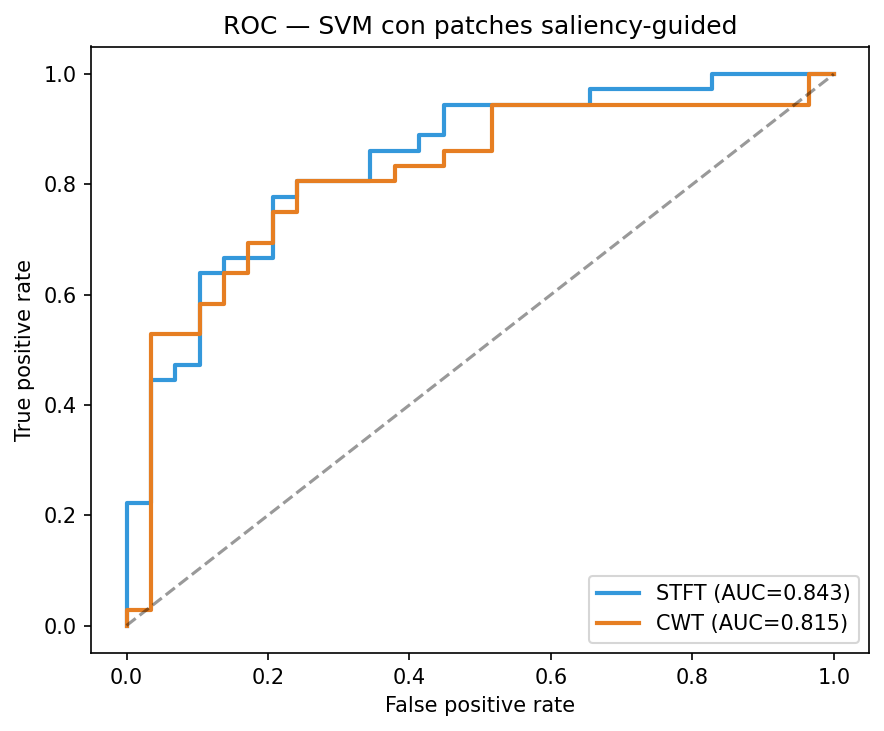

*Figura 1. Curva ROC del SVM con saliency vainilla, agregada sobre todos los sujetos (LOSO).*

### 4.2 Síntesis del confound: STFT vs CWT a través de tres pipelines

Las otras dos arquitecturas replican el mismo patrón. Con la CNN end-to-end, igualar el eje recupera buena parte del déficit de la CWT (AUC 0.590 → 0.667, acercándose a STFT 0.695); la CNN opera cerca del baseline trivial (0.554), coherente con su rol de extractor y su dropout agresivo. Con SVM + Grad-CAM, la CWT *nativa* parecía la mejor (0.800), pero al igualar el eje CWT-fair baja a 0.769, de nuevo hacia STFT.

| CNN end-to-end | Acc | F1 macro | AUC |
|---|---|---|---|
| STFT | 0.656 ± 0.024 | 0.647 ± 0.024 | 0.695 ± 0.022 |
| CWT nativa | 0.626 ± 0.071 | 0.625 ± 0.071 | 0.590 ± 0.069 |
| **CWT-fair** | 0.656 ± 0.062 | 0.655 ± 0.061 | **0.667 ± 0.067** |
| **SVM Grad-CAM** | **Acc** | **F1** | **AUC** |
| STFT | 0.662 ± 0.031 | 0.643 ± 0.033 | 0.713 ± 0.020 |
| CWT nativa | **0.703 ± 0.009** | **0.697 ± 0.012** | **0.800 ± 0.010** |
| CWT-fair | 0.682 ± 0.054 | 0.673 ± 0.050 | 0.769 ± 0.045 |

*Tabla 6. CNN end-to-end y SVM Grad-CAM, multi-seed. Las cifras de SVM vainilla están en la Tabla 4.*

**El efecto del eje, en cifras.** La magnitud del artefacto se lee comparando cada CWT contra STFT antes y después de igualar el eje. Con vainilla, la brecha pasa de -0.078 AUC (nativa) a **-0.028** (fair), un ~64%; con Grad-CAM, de +0.087 (nativa) a **+0.056** (fair), un ~36%. En ambas direcciones —la CWT parecía peor con vainilla y mejor con Grad-CAM— **igualar el eje mueve la CWT hacia la STFT**; las diferencias aparentes eran, en gran parte, el artefacto de DSP y no la transformada (con Grad-CAM el eje explica solo ~un tercio, y el efecto por seed es de signo mixto).

La inferencia usa DeLong AUC pareado *dentro de cada seed* (n = 65), combinado entre seeds con Stouffer/Fisher:

| Comparación (SVM vainilla) | Δ AUC por seed | Stouffer p | Lectura |
|---|---|---|---|
| STFT vs CWT **nativa** (confundida) | +0.028, +0.105, +0.101 | **0.061** | marginal: transformada + eje |
| **STFT vs CWT-fair** (justa) | -0.021, +0.036, +0.069 | **0.318** | NS a igualdad de eje |
| CWT nativa vs CWT-fair (efecto eje) | -0.049, -0.069, -0.032 | **0.283** | NS: el eje explica el grueso |

*Tabla 7. DeLong por seed + Stouffer (SVM vainilla). La ventaja marginal STFT vs CWT nativa (p = 0.061) se disuelve a p = 0.318 al igualar el eje.*

La ventaja marginal de STFT sobre la CWT nativa (p = 0.061) se disuelve a p = 0.318 al pasar a la comparación justa: ese p ≈ 0.06 estaba impulsado por el artefacto, no por la transformada. Con Grad-CAM ocurre lo mismo: la comparación confundida STFT vs CWT nativa era marginal (p = 0.068) y las justas no significativas (STFT vs CWT-fair p = 0.587; nativa vs fair p = 0.527). Bajo corrección Benjamini-Hochberg (α = 0.05, familia de m = 3: CNN, SVM Grad-CAM, SVM vainilla) ninguna comparación justa se acerca a la significancia:

| Comparación justa (STFT vs CWT-fair) | p (Stouffer) | BH-FDR q | Sig. |
|---|---|---|---|
| SVM vainilla | 0.318 | 0.679 | × |
| SVM Grad-CAM | 0.587 | 0.679 | × |
| CNN | 0.679 | 0.679 | × |

*Tabla 8. Corrección por comparaciones múltiples (BH-FDR).*

Un test de Wilcoxon pareado de scores por sujeto (SVM vainilla, STFT vs CWT nativa) corrobora la falta de un efecto consistente incluso en la comparación confundida: solo la semilla s1 da p = 0.025 (s0 = 0.893, s2 = 0.338), y esa señal se pierde tras corrección Bonferroni intra-seed (α = 0.0167). En conjunto —tres pipelines, DeLong + Stouffer, BH-FDR y Wilcoxon— **a igualdad de eje de modulación no hay evidencia de superioridad de ninguna transformada** (potencia limitada, 3 seeds). Las Figuras 2–5 resumen visualmente la convergencia.

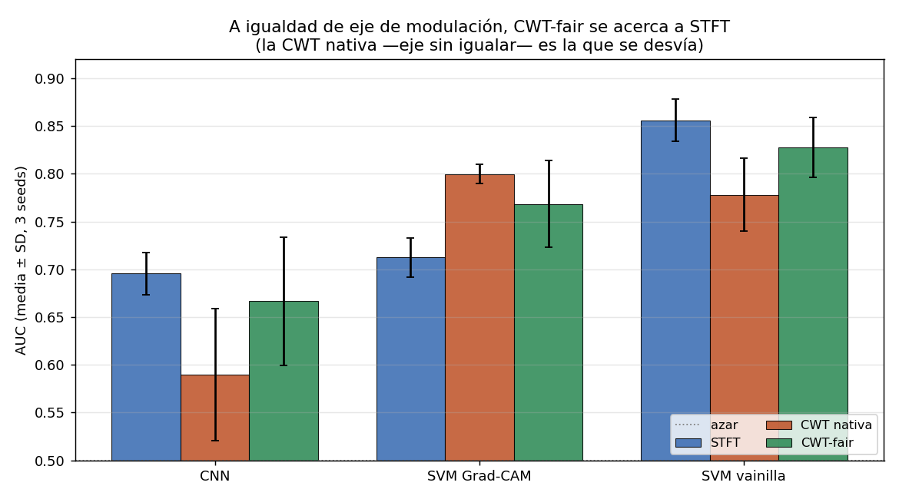

*Figura 2. AUC (media ± SD, 3 seeds) por pipeline y transformada. Al igualar el eje, **CWT-fair (verde) se desplaza hacia STFT (azul)** en los tres pipelines; la que se desvía es la CWT nativa (naranja).*

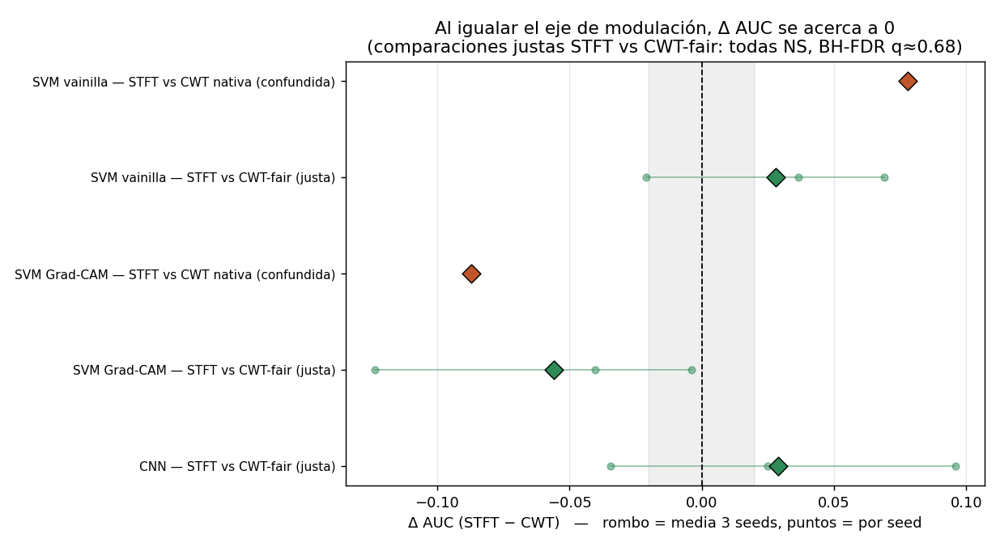

*Figura 3. Forest plot de ΔAUC (STFT − CWT). Las comparaciones *confundidas* (rombos naranjas) están lejos de 0 (±0.08); las *justas* STFT vs CWT-fair (verdes) se centran sobre 0. Todas las justas son NS (BH-FDR q ≈ 0.68).*

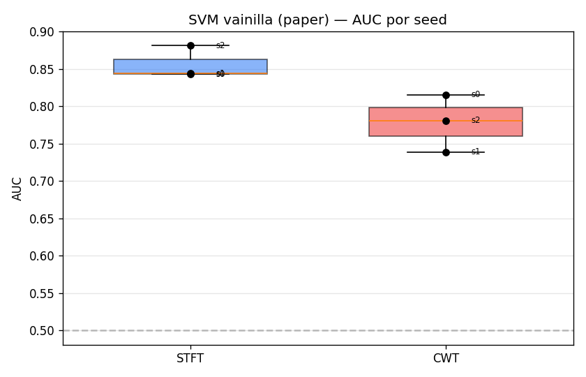

*Figura 4. Distribución de AUC por sujeto-test (LOSO) para SVM vainilla, agregada a través de 3 seeds.*

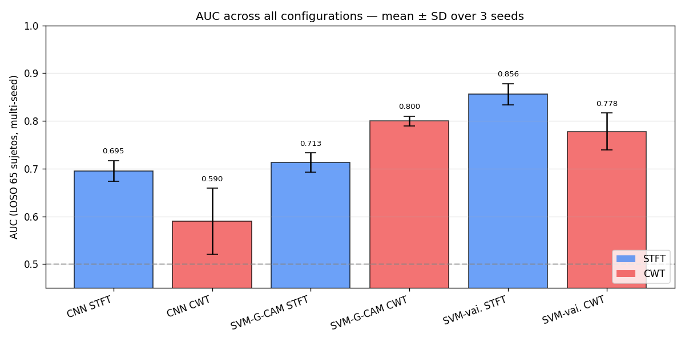

*Figura 5. Resumen visual de AUC por configuración (6 combinaciones CNN/SVM vainilla/SVM Grad-CAM × STFT/CWT, error bars entre seeds). Mejor configuración: SVM vainilla STFT (AUC = 0.856).*

### 4.3 Análisis exploratorio (post-hoc)

Los análisis de esta subsección no estaban pre-registrados y deben leerse como exploratorios. **Correlación 2D entre saliency maps** (Pearson r, media ± SD sobre 3 seeds):

| Comparación | Pearson r |
|---|---|
| STFT vs CWT (Grad-CAM) | -0.237 ± 0.119 |
| STFT vs CWT (vainilla) | -0.086 ± 0.076 |
| Grad-CAM vs vainilla (STFT) | +0.114 ± 0.043 |
| Grad-CAM vs vainilla (CWT) | -0.166 ± 0.106 |

*Tabla 9. Correlación entre saliency maps. STFT y CWT están débilmente correlacionados, cerca de cero (r ≈ -0.09 vainilla, -0.24 Grad-CAM): descubren regiones distintas. Con 3 seeds no se puede afirmar independencia estadística ni "anti-correlación".*

**Bandas canónicas y canales** (solo STFT: el eje portador de la CWT es log-espaciado, `geomspace`, y la asignación píxel → banda difiere de la STFT lineal). La saliency de STFT + vainilla se concentra en α (61.1%) + θ (27.9%) (~89%), mientras que la de STFT Grad-CAM se va casi toda a γ (99.3%):

| Configuración | δ (0.5–4) | θ (4–8) | α (8–13) | β (13–30) | γ (30–45) |
|---|---|---|---|---|---|
| **STFT vainilla** | 5.8% | **27.9%** | **61.1%** | 5.3% | 0.0% |
| STFT Grad-CAM | 0.0% | 0.0% | 0.0% | 0.7% | 99.3% |

*Tabla 10. Proporción de píxeles top-10% de saliency por banda (solo STFT).*

Por canal (ANOVA F-score sobre las features del SVM vainilla STFT), los más informativos son occipitales y temporales posteriores —O2 (0.110 ± 0.004) y T5 (0.110 ± 0.006), O1 (0.103 ± 0.005), T6 (0.074 ± 0.003), T3 (0.060 ± 0.015)—, coherentes con la literatura clínica EEG-AD (atenuación α occipital, atrofia temporal medial); el menos informativo es C4 (rank 19, 0.014 ± 0.004) (Figura 6).

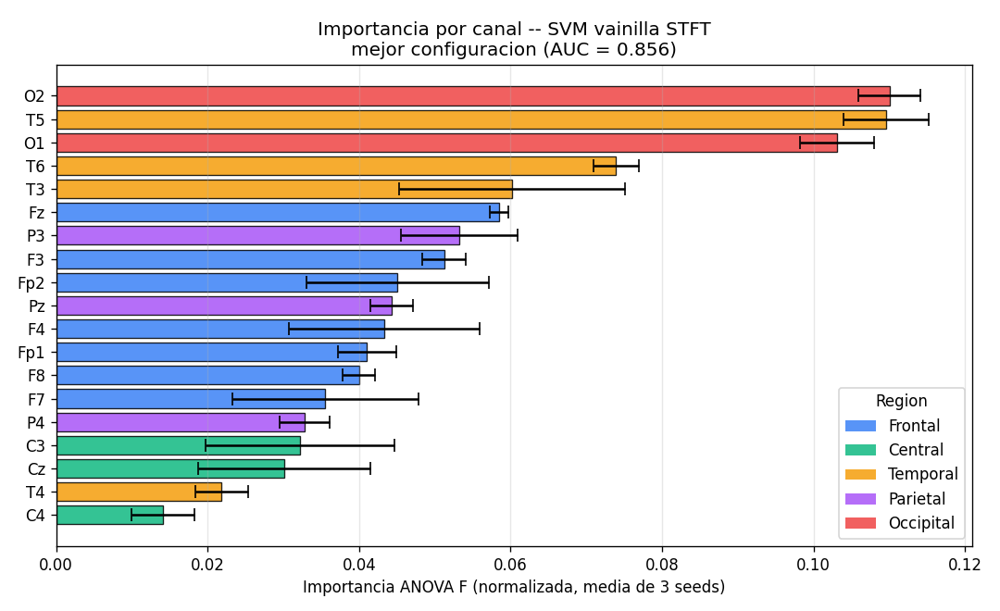

*Figura 6. Importancia por canal del SVM vainilla STFT (mejor configuración, AUC = 0.856).*

**Estabilidad de patches.** El Jaccard entre máscaras de patches de pares aleatorios de folds es muy bajo (STFT Grad-CAM 0.050–0.063; STFT vainilla 0.036–0.051; CWT Grad-CAM 0.042–0.045; CWT vainilla 0.026–0.030): **los patches descubiertos son muy inestables entre folds** (≈0.03–0.06), lo que matiza cualquier narrativa de "biomarcadores reproducibles" pese a las buenas métricas globales.

### 4.4 Late-fusion y equivalencia (TOST)

Ambos análisis reutilizan los scores por sujeto ya guardados, sin re-entrenar. Promediar los scores de STFT y CWT-fair (SVM vainilla) da un **late-fusion** con AUC **0.867 ± 0.014**, una mejora leve sobre STFT (0.856 ± 0.022; +0.011) y con *menor* varianza entre seeds. Pero la ganancia es pequeña e inconsistente (por seed: +0.033, +0.008, -0.007) y no se sostiene en el ensemble mediana (STFT 0.900 vs fusión 0.887): es un **indicio de complementariedad parcial, no un resultado concluyente**, coherente con la baja correlación de los saliency maps.

Un **test de equivalencia (TOST)** sobre ΔAUC = STFT − CWT-fair (margen δ = ±0.05) *no* declara equivalencia: a nivel de seed, ΔAUC = -0.021, +0.036, +0.069 (media +0.028 ± 0.046), p = 0.246; por bootstrap de sujeto, ΔAUC = +0.051 con IC90 [-0.000, +0.107] (no cabe en ±0.05; el δ mínimo sería ≈0.11). La conclusión rigurosa es, por tanto, *"no se detecta diferencia"* (DeLong p = 0.318), **no "equivalencia demostrada"**: con 3 seeds y n = 65 el estudio no tiene potencia para probar equivalencia en un margen estrecho.

---

## 5. Discusión

### 5.1 ¿CWT supera a STFT? Interpretación del confound

A igualdad de eje de modulación, STFT y CWT-Morlet son estadísticamente indistinguibles: ni la hipótesis original (CWT > STFT) ni la inversa obtienen soporte (§4.2). Lo relevante es que la conclusión ingenua —leer la Tabla 4 o las de la CNN y Grad-CAM sin control— habría sido errónea en *ambas* direcciones: con vainilla la CWT parece peor, con Grad-CAM parece mejor, y ninguna de esas diferencias sobrevive cuando se iguala el eje. Atribuir a la transformada un efecto que en realidad es del muestreo es exactamente el error que CWT-fair evita.

La lectura defendible es que *bajo un eje de modulación equiparable, la elección STFT vs CWT-Morlet no cambia el poder discriminativo de este pipeline*. Es una afirmación más fuerte y honesta que el resultado ingenuo. Persisten algunos matices que acotan su generalización: CWT-fair iguala "hacia abajo" (§3.1), la CWT muestra mayor varianza entre seeds (±0.031–0.045 fair vs ±0.022 STFT), y solo se exploró `cmor1.5-1.0` con 32 escalas, sin tuning específico ni cone-of-influence. Visualmente, el efecto es directo: al igualar el eje, el espectro de modulación de la CWT-fair pierde el "cono" de la wavelet y su estructura se acerca a la de la STFT (Figuras 7–8).

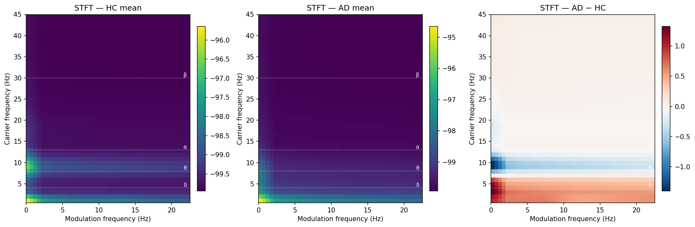

*(a) STFT.*

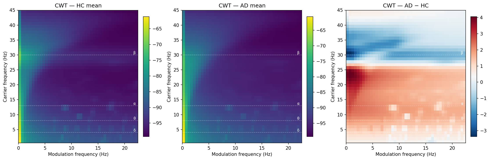

*(b) CWT-Morlet.*

*Figura 7. Espectrogramas de modulación promedio (AD vs HC) bajo STFT y CWT nativa. La presentación 45×45 oculta el desajuste del rango del eje de modulación (Nyquist 1.56 Hz vs 100 Hz).*

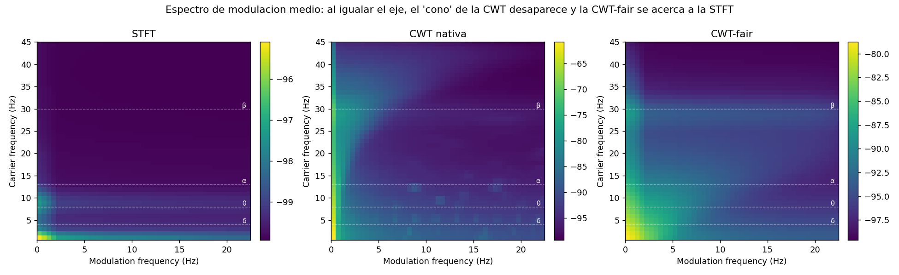

*Figura 8. Espectro de modulación medio bajo las tres condiciones (STFT | CWT nativa | CWT-fair). Al igualar el eje, la **CWT-fair pierde el "cono"** de la wavelet —visible en la CWT nativa como energía que se extiende hasta modulaciones altas— y su estructura se acerca a la de la STFT. Iguala el eje de modulación (horizontal), no el de portadora (vertical); por eso convergen las métricas (§4.2) pero no necesariamente los mapas de saliency (§5.2).*

### 5.2 El método de saliency y el ranking aparente

Con la CWT **nativa**, el ranking se invierte según el método de saliency (Grad-CAM: CWT > STFT; vainilla: STFT > CWT). Esa sensibilidad también **se atenúa con CWT-fair**: al quitar el confound del eje, las dos representaciones convergen bajo ambos métodos. Es decir, parte de la aparente "dependencia del método de saliency" era, otra vez, el eje de modulación interactuando con cómo cada método pondera las regiones. Los saliency maps de STFT y CWT están débilmente correlacionados (r ≈ -0.09 vainilla, -0.24 Grad-CAM): descubren regiones distintas (Figura 9), pero ello ya no se traduce en diferencia de desempeño una vez igualado el eje (Figura 10). La lección práctica es reportar siempre el método de saliency específico, porque afecta las conclusiones cuantitativas.

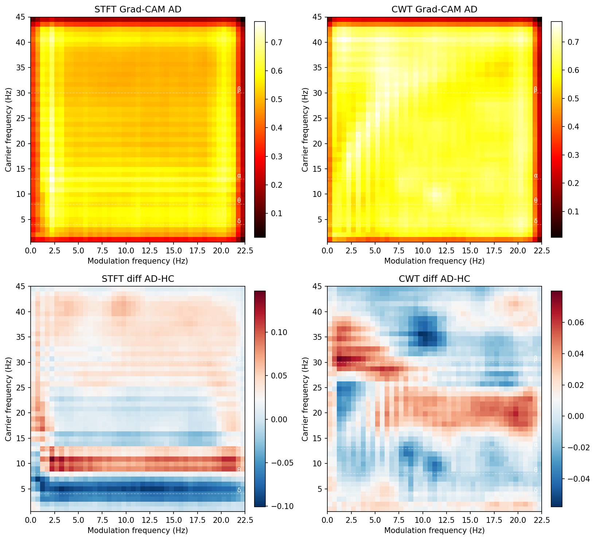

*Figura 9. Saliency maps medios STFT vs CWT (método vainilla): cualitativamente distintos, coherente con r ≈ -0.09.*

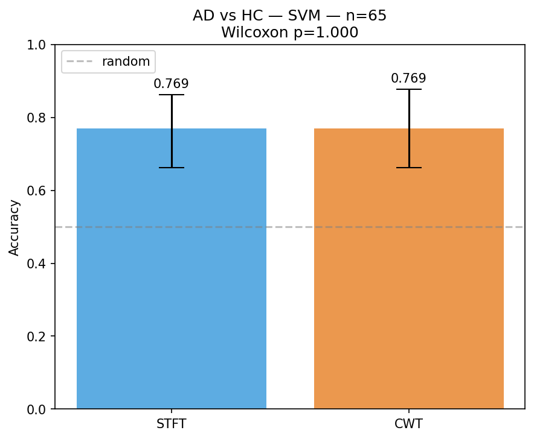

*Figura 10. Comparación cuantitativa SVM (saliency vainilla): STFT vs CWT por configuración.*

### 5.3 Desempeño estratificado por género

El sesgo de género del dataset (§2) motiva un análisis estratificado sobre el ensemble multi-seed por mediana (§4.1). Separando por género:

| Género | n | AD/HC | Aciertos | Acc | AUC |
|---|---|---|---|---|---|
| Mujer | 35 | 24/11 | 27/35 | 0.771 | 0.852 |
| Hombre | 30 | 12/18 | 27/30 | 0.900 | 0.940 |
| Diferencia | — | — | — | **+0.129** | +0.088 |
| Fisher F vs M | — | — | OR ≈ 0.375 | **p = 0.201** | Cohen h ≈ 0.35 |

*Tabla 11. Desempeño por género (Fisher exact sobre clasificación correcta).*

No se detectó diferencia significativa (p = 0.201), pero el poder es limitado: con un efecto Cohen h ≈ 0.35, detectar la diferencia observada al 80% de poder requeriría N ≈ 64 sujetos por grupo (≈128 en total), mientras que el tamaño actual (35F + 30M) da un poder de ~25–30%. La diferencia absoluta de 12.9 puntos en accuracy es relevante en magnitud, así que no puede descartarse un sesgo real del modelo: **ausencia de evidencia no es evidencia de ausencia**.

### 5.4 Contribución y posicionamiento

Más allá de la replicación, el aporte de este trabajo es metodológico: (i) una **evaluación multi-seed** del pipeline (el paper no reporta varianza por seed); (ii) el **diagnóstico del confound del eje de modulación** al comparar STFT vs CWT; (iii) un **control operacional, CWT-fair**, que iguala el eje decimando la envolvente; (iv) la **evidencia de que, con el eje igualado, STFT ≈ CWT** (sin diferencia detectable); y (v) una **reproducibilidad completa** (repo público con `requirements-lock.txt`, seeds fijas, configs YAML y tests unitarios). El aporte no es una transformada ni un método de modspec nuevos, sino un *diagnóstico + un control experimental + un resultado nulo informativo*: traslada el principio de "comparación justa de representaciones" —conocido en audio para el eje portador— al **segundo eje, el de modulación**, donde no se había planteado para el espectro de modulación de EEG.

| Nivel | Afirmación | Estatus |
|---|---|---|
| Conocido | El eje de modulación es una dimensión con su propio ancho de banda y bandas definidas | Fraga 2012; Cassani 2013/2020 |
| Conocido | Al comparar representaciones T-F hay que igualar confounds; STFT/wavelet convergen con datos suficientes | Huzaifah 2017; Choi 2017 |
| Latente | Cambiar el front-end (STFT ↔ wavelet) altera la tasa de envolvente → Nyquist y span del eje de modulación | Implícito en Lopes 2023 |
| **Nuevo** | Diagnóstico explícito del confound del eje de modulación al comparar STFT vs CWT para el modspec | Aporte propio |
| **Nuevo** | Control operacional **CWT-fair** que iguala el eje decimando la envolvente | Aporte propio |
| **Nuevo** | Evidencia de que, con el eje igualado, STFT ≈ CWT (sin diferencia detectable) | Aporte propio |

*Tabla 12. Qué es conocido, latente y nuevo en la contribución.*

Frente al SOTA de *desempeño*: en `ds004504` bajo validación honesta sujeto-independiente (LOSO), la literatura reciente reporta ~71–83% de accuracy; este trabajo (Acc 0.764 / AUC 0.856) queda por encima de la media LOSO y ~7 puntos por debajo del mejor comparable (DICE-net, conv-transformer, 83.28% LOSO; Miltiadous et al. 2023), y lejos de los *foundation models* de EEG (p. ej. LEAD ~91% F1). El nicho de este trabajo no es la carrera de accuracy, sino la replicación *leakage-free* y el aporte metodológico de DSP.

### 5.5 Limitaciones

1. **Solo 3 seeds**: se cuantifica la varianza, pero el número de réplicas es bajo para inferencias fuertes; idealmente ≥10.
2. **CWT-fair iguala "hacia abajo"** el eje de modulación (§3.1): es la definición conservadora, no única; igualar "hacia arriba" (STFT de hop fino) queda como trabajo futuro. Por eso la conclusión es "a igualdad de eje de modulación *lento*".
3. **Grid search de patches heurístico**, no nested CV (selección por separabilidad de saliency map).
4. **BH-FDR post-hoc**, no pre-registrada (ninguna comparación justa se acerca a la significancia igualmente).
5. **CWT subexplorada**: solo `cmor1.5-1.0`, 32 escalas log, sin cone-of-influence ni tuning; los hiperparámetros del CNN fueron optimizados por Lopes para input STFT, y la CNN queda sub-entrenada (dropout 0.85).
6. **Atribución de bandas restringida a STFT** (eje portador CWT log-espaciado requiere otro mapeo); **patches inestables** entre folds (Jaccard ≈ 0.05, §4.3).
7. **Poder estadístico modesto** en los sub-análisis (género N = 65, poder ~25–30% para h ≈ 0.35; §5.3). El overlap del 87.5% entre epochs intra-sujeto no afecta los tests, que son a nivel de sujeto.
8. **Alcance**: una sola tarea binaria (T2 de las 5 del paper), sin validación externa; los análisis post-hoc son exploratorios.

---

## 6. Conclusiones

El pipeline de Lopes et al. (2023) se replica funcionalmente sobre datos públicos (SVM vainilla + STFT: Acc 0.764, AUC 0.856, §4.1). Su hallazgo central, sin embargo, es metodológico: comparar representaciones tiempo-frecuencia para el espectro de modulación exige **igualar el eje de modulación**, porque las diferencias de resolución temporal nativa crean un confound que puede invertir el ranking aparente. Con el control CWT-fair, STFT y CWT-Morlet resultan indistinguibles en las tres arquitecturas y ninguna comparación justa sobrevive BH-FDR (§4.2); es, eso sí, *ausencia de diferencia detectable* y no equivalencia probada (§4.4). La sensibilidad del ranking al método de saliency era, en parte, el mismo confound (§5.2), y los patches descubiertos —aunque coherentes con biomarcadores clásicos de EA en α + θ y canales occipito-temporales— son inestables entre folds. El valor del trabajo no es un número de accuracy sino el rigor comparativo: un diagnóstico, un control replicable y un resultado nulo informativo (§5.4). Las líneas futuras más directas son igualar el eje "hacia arriba" (para ver si las modulaciones rápidas que CWT-fair descarta aportan algo), confirmar la complementariedad del late-fusion con ≥10 seeds y un test formal, y validar en un dataset EEG-AD externo.

---

## 7. Reproducibilidad

**Repositorio**: https://github.com/spalaciobe/tps-alzheimer-modspec

**Para reproducir**:

```bash
git clone https://github.com/spalaciobe/tps-alzheimer-modspec.git
cd tps-alzheimer-modspec
python -m venv .venv && source .venv/Scripts/activate
pip install -r requirements-lock.txt && pip install -e .
python scripts/00_download_dataset.py
bash scripts/run_remaining_v2.sh
```

**Tiempos en RTX 3050 Laptop (4 GB)**: preproceso 65 sujetos ~35 min; modspecs (STFT + CWT) ~90 min; LOSO CNN ×3 seeds ×2 métodos ~14 h; saliency ×12 corridas ~12 h; SVM ×12 corridas ~12 h; post-análisis + figuras ~30 min. **Total**: ~48 h de cómputo continuo. **Stack**: Python 3.13, PyTorch 2.6+cu124, MNE 1.12, scikit-learn 1.8.

---

## Bibliografía

1. M. Lopes, R. Cassani, T. H. Falk. Using CNN saliency maps and EEG modulation spectra for improved and more interpretable machine learning-based Alzheimer's disease diagnosis. *Computational Intelligence and Neuroscience*, vol. 2023, art. 3198066, 2023. DOI: 10.1155/2023/3198066.

2. A. Miltiadous *et al.* A dataset of scalp EEG recordings of Alzheimer's disease, frontotemporal dementia and healthy subjects from routine EEG. OpenNeuro `ds004504`, CC0 1.0, 2023.

3. L. R. Trambaiolli *et al.* EEG spectro-temporal modulation energy: A new feature for automated diagnosis of Alzheimer's disease. *IEEE EMBC*, pp. 3828–3831, 2011.

4. F. J. Fraga *et al.* Characterizing Alzheimer's disease severity via resting-awake EEG amplitude modulation analysis. *PLoS ONE*, vol. 8, no. 8, e72240, 2013.

5. R. Cassani, T. H. Falk. Alzheimer's disease diagnosis and severity level detection based on EEG modulation spectral 'patch' features. *IEEE J. Biomed. Health Inform.*, vol. 24, no. 7, pp. 1982–1993, 2020.

6. R. R. Selvaraju *et al.* Grad-CAM: Visual explanations from deep networks via gradient-based localization. *ICCV*, 2017.

7. K. Simonyan, A. Vedaldi, A. Zisserman. Deep inside convolutional networks: Visualising image classification models and saliency maps. *ICLR Workshop*, 2014.

8. L. Pion-Tonachini, K. Kreutz-Delgado, S. Makeig. ICLabel: An automated electroencephalographic independent component classifier. *NeuroImage*, vol. 198, pp. 181–197, 2019.

9. A. Gramfort *et al.* MEG and EEG data analysis with MNE-Python. *Frontiers in Neuroscience*, vol. 7, no. 267, 2013.

10. World Health Organization. Dementia fact sheet, 2023. https://www.who.int/news-room/fact-sheets/detail/dementia
